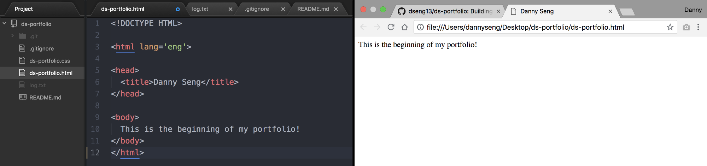

<start>There were a lot of things</start> I didn't like about my previous portfolio. The biggest issues were that I overestimated how much content that was needed to finish my website. I procrastinated a lot when it came to writing the case studies and felt rushed to finish them when I needed to publish the site soon.

For some reference, check out my [old portfolio](https://jasonyeung-old.netlify.com).

#### What's next?
**Projects**. Although I feel have the skills as developer, it certainly doesn't look like it.
It is a long established fact that a reader will be distracted by the readable
content of a page when looking at its layout. The point of using Lorem Ipsum
is that it has a more-or-less normal distribution of letters, as opposed to using
'Content here, content here', making it look like readable English. 