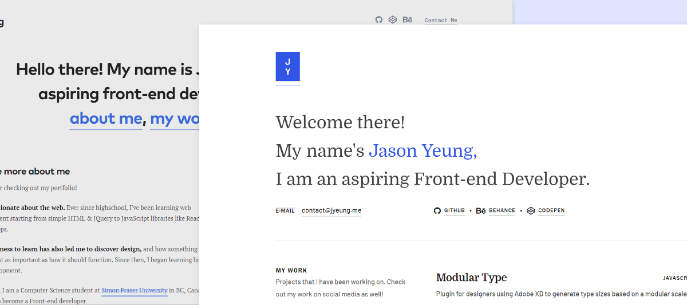
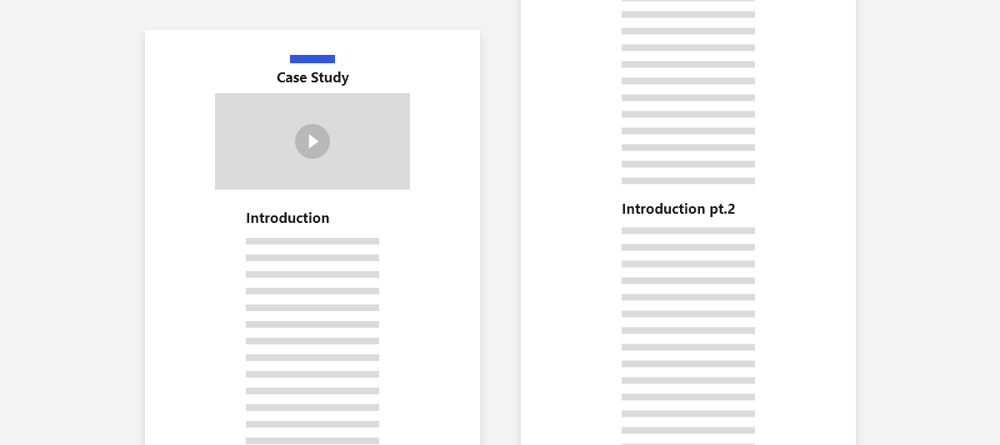

<start>There were a lot of things</start> I didn't like about my previous portfolio. The biggest issues were that I overestimated the content I needed to finish my website. Let me explain the things I tried to fix in this new portfolio:

For some reference, here's my [old portfolio](https://jasonyeung-old.netlify.com).

#### ~~Case Studies~~ → Articles
Intially, I added case studies to every project to showcase my thought process — it was a *nightmare* to do. I rushed them off haphazardly so I could publish the site as soon as possible.

The case studies were simply too long, unfocused, and unfinished. 
In the end, it left a really bad taste in my mouth now that I'm reading them again.
[Just look at an example](https://jasonyeung-old.netlify.com/case-studies/do-you-love-fluffy/). 

The Solution? **Articles!** Instead of having full-fledged case studies, I created articles for my portfolio (what you're reading right now!). It lets me write anything I want: personal stuff, technical stuff, cool stuff... 

so much better than worrying about a 10 page case study for one miniscule project.

#### ~~Unfinished Design~~
I didn't like the design of my old site. Well... that's because it was unfinished. 

When designing the site, I relied on large amounts of content I didn't have. Bad mistake — I never actually finished the content so the whole site felt unfinished as a result. However, redesigning my new portfolio became much easier 

### The About Section

### What's next?
**Projects:** Although I feel have the skills of a developer, it certainly doesn't look like it. 
I hope to work on more projects that I can show on my portfolio.

**Resume:** I still need to redesign my resume to reflect the branding on my site.
I also want to rewrite my content on it.

**Data Structures & Algorithms:** My problem-solving skills are weak; embarassing but I struggle to even do LeetCode *easy* problems. So far, I've been reading CTCI so hopefully I can recover what I've slacked off in school. 

Although my portfolio's finished I still have a lot more to do. With more time and practice I might eventually be able to do what I want to do!
